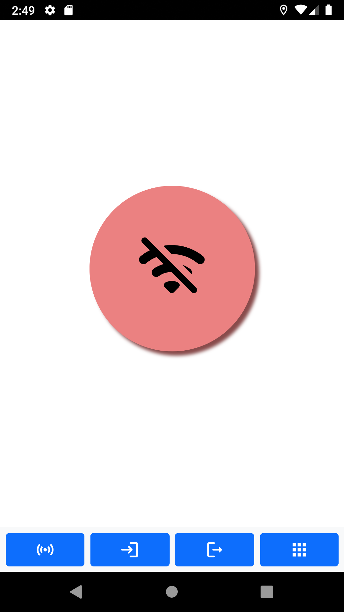
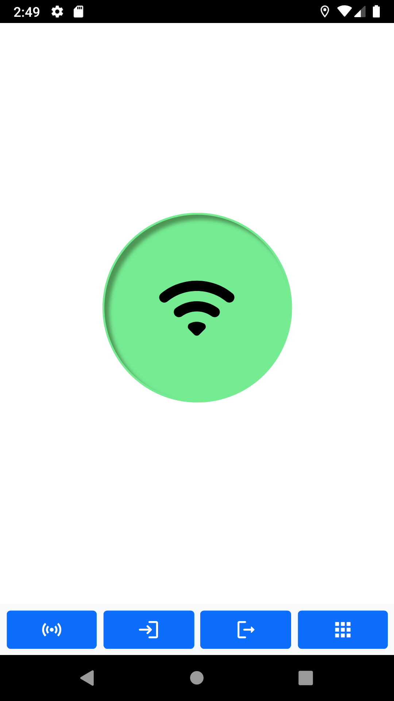
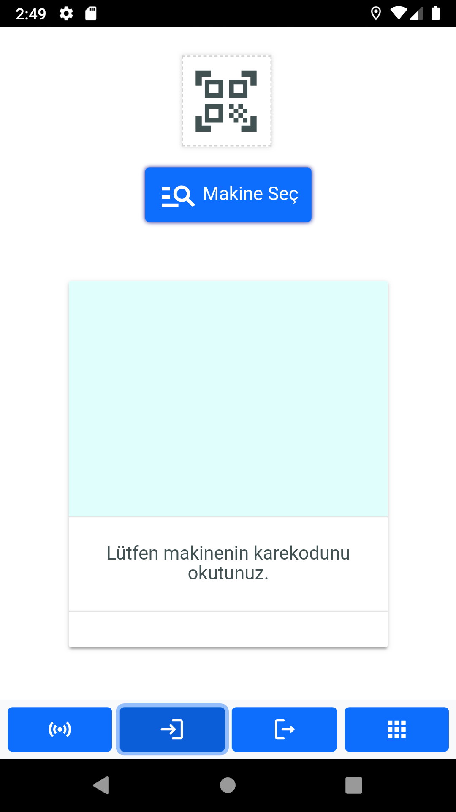
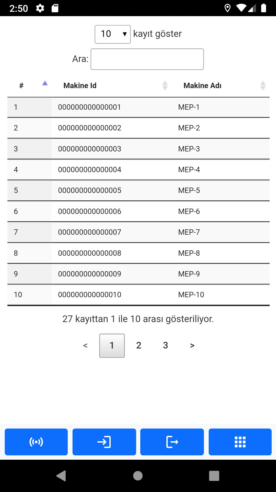
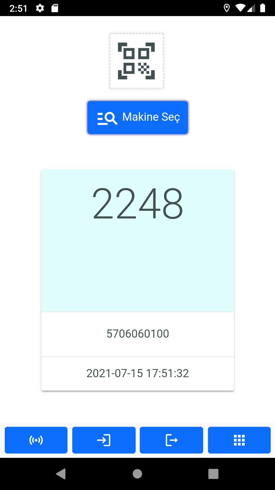
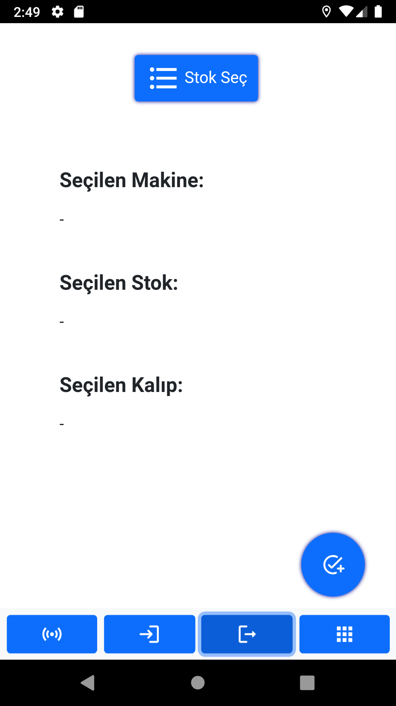
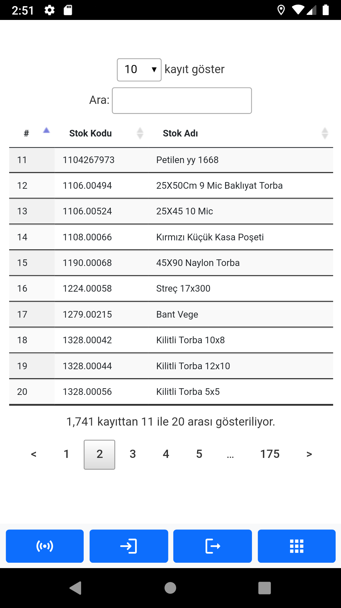
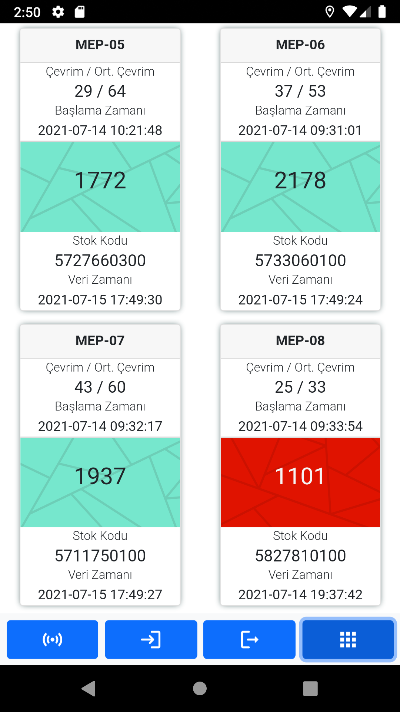

# Production Tracking Mobile App Screenshots

This app is an Apache Cordova based project which is written in HTML/CSS, JavaScript. It can be built for iOS and Android. It has features like
- Reading QR code/barcode
- Retrieving production data from server using MQTT
- Changing production details in ERP program for example which stock is been producing

**App is in use by firms because of this I will publish the codes when it is available.**

## Main Goal Of The Project
This project is developed for facilities that want to track its machines in production. First, we setup an data collecting system, later this system writes data to database using MQTT communication protocol. *(This is not the only way to record data.)*

While this process is running, user can use the mobile app for monitoring an individual machine or facility's whole machines with a few clicks. User can make change on the production module in ERP system by deciding which item is been producing by using this mobile app.

## Preview of the App

| Image | Description |
| --- | --- |
|  | *Image 1  This is the login screen. Users have individual IDs for them and their firms and a password.* |
|   | *Image 2 & 3  This is the connection screen. Users will connect their MQTT broker on this page to get/send data.* |
|  | *Image 4  This is the watching screen. Users will choose a machine and later chosen machine's information will be printed on the card.* |
|  | *Image 5  This is the machines screen. Users will choose a machine from the list.* |
|  | *Image 6  Selected machine's data is printed.* |
|  | *Image 7  This is the page for changing the item in production phase. User can select an item from the stock list by clicking the button on the top of the screen.  If all fields (seçilen stok, seçilen makine, seçilen kalıp) are defined and not empty, user can change the item which is in production.* |
|  | *Image 8  This is the stocks page. Stock items that defined in the ERP system are listed.* |
|  | *Image 9  This is the all machines status page. User can watch all machines' statuses with this page. Cards contain lots of information about machines such as   - What is the name of the machine   - Which item is been producing in which machine   - When started this item's production   - When the last signal came from the machine   - Average cycle time / Target cycle time   - How many pieces are produced in the machine* |
