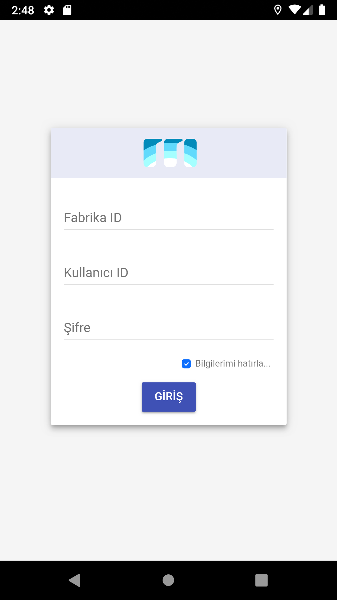

# Production Tracking Mobile App Screenshots

This app is an Apache Cordova based project which is written in HTML/CSS, JavaScript. It can be built for iOS and Android. It has features like
- Reading QR code/barcode
- Retrieving production data from server using MQTT
- Changing production detail in ERP program for example which stock is been producing 
App is using by a firm that 

## Main Goal Of The Project

